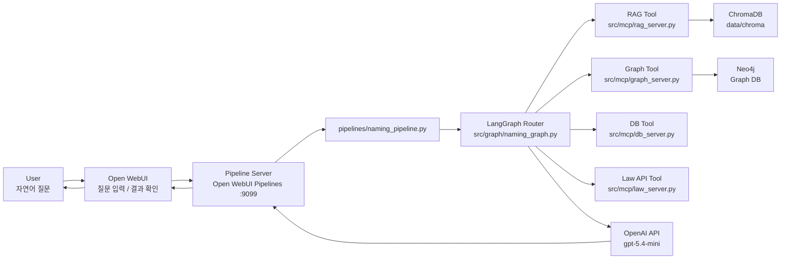

# 2026-06-17 프로젝트 최종 점검 및 발표 전후 정리

> 대상 프로젝트: `SKN29-3rd-4Team`  
> 주제: 조건 기반 맞춤 작명 QA 시스템  
> 작성 목적: 2026년 6월 17일 진행한 프로젝트 최종 점검, 문서 정리, 산출물 검증, 프로젝트 발표 전후의 보완 내용을 정리한다.

---

## 1. 작업 배경

6월 17일 작업의 핵심은 프로젝트 최종 제출 전, 실제 구현 구조와 문서 산출물이 서로 일치하는지 확인하고 GitHub에서 평가자가 프로젝트를 이해하기 쉽게 문서 구조를 정리하는 것이었다.

프로젝트는 Open WebUI를 사용자 인터페이스로 두고, Pipeline Server가 자연어 질문을 받아 LangGraph Router, ChromaDB, Neo4j, MCP Tool, OpenAI API를 조합해 작명 QA를 처리하는 구조다. 실제 저장소는 완성형 프론트엔드 전체를 담는 저장소가 아니라, Open WebUI에 연결되는 Pipeline Server와 내부 처리 흐름을 중심으로 구성되어 있다.

이날 작업은 크게 네 가지로 나뉜다.

| 구분 | 작업 내용 |
|---|---|
| 프로젝트 구조 점검 | Docker, Pipeline Server, LangGraph, MCP Tool, ChromaDB, Neo4j 구조 확인 |
| 문서 통합 | 최종 통합 문서와 독립형 통합 문서 작성 |
| 문서 재정리 | `docs` 폴더 내 문서들을 성격별 카테고리로 이동 |
| 검증 및 발표 준비 | 데이터 건수, ChromaDB 컬렉션, 테스트 결과, 발표 전 최종 문서 구조 점검 |

---

## 2. 최종 시스템 구조 점검

최종 기준 프로젝트 구조는 다음과 같이 정리했다.



확인한 핵심 사항은 다음과 같다.

| 점검 항목 | 확인 내용 | 결과 |
|---|---|---|
| Docker 구성 | `docker-compose.yml`에는 `pipelines` 서비스가 정의되어 있음 | 정상 |
| Pipeline Server | `naming-pipelines` 컨테이너, `9099:9099` 포트 사용 | 정상 |
| Open WebUI | 사용자 질문 입력과 결과 확인을 담당하는 별도 서비스 또는 외부 연결 대상 | 정상 |
| Neo4j | Graph DB로 별도 실행 대상이며 저장소는 연결 코드와 인덱싱 코드 보유 | 정상 |
| Pipeline 진입점 | `pipelines/naming_pipeline.py` | 정상 |
| LangGraph 핵심 파일 | `src/graph/naming_graph.py` | 정상 |
| MCP Tool | `src/mcp/rag_server.py`, `db_server.py`, `law_server.py`, `graph_server.py` | 정상 |
| 운영 모델 | Router, Generate, Verify 모두 `gpt-5.4-mini` 기준 | 정상 |

---

## 3. Pipeline Server 구현 기준

Pipeline Server는 Open WebUI Pipelines 요청을 받아 LangGraph를 실행하는 역할을 한다.

| 파일 | 역할 |
|---|---|
| `pipelines/naming_pipeline.py` | Open WebUI 요청 수신, 대화 이력 기반 질의 재구성, LangGraph 호출 |
| `src/graph/naming_graph.py` | Router, Tool 노드, Generate, Clarify, 검증/후처리 구현 |
| `src/mcp/rag_server.py` | ChromaDB 검색, 한자/순우리말 후보 샘플링 |
| `src/mcp/db_server.py` | 81수리, 吉수, 오행 조합, 이름 통계 계산 |
| `src/mcp/law_server.py` | 국가법령정보 API, 우리말샘 API 연동 |
| `src/mcp/graph_server.py` | Neo4j 기반 한자/오행/법령 관계 조회 |

특히 `src/mcp`의 파일들은 MCP Tool 서버 형태로 작성되어 있지만, 현재 Pipeline 컨테이너에서는 별도 MCP 서버 프로세스를 띄우지 않고 Python 함수로 직접 import해 호출한다. 이를 위해 `naming_pipeline.py`에서 FastMCP 데코레이터가 import 과정에서 문제를 일으키지 않도록 호환 스텁을 주입한다.

---

## 4. 데이터 및 산출물 검증

문서에 적힌 데이터 수치가 실제 산출물과 일치하는지 `data/processed` JSON 파일과 `data/chroma/chroma.sqlite3`를 기준으로 확인했다.

### 4.1 정제 데이터 검증

| 산출물 | 실제 건수 | 사용 목적 |
|---|---:|---|
| `hanja_documents.json` | 2,420 | 추천용 인명 한자 기본 후보군 |
| `hanja2_candidate_documents.json` | 6,564 | 확장 한자 후보군 |
| `suri_documents.json` | 81 | 81수리 설명 및 계산 근거 |
| `ohaeng_documents.json` | 125 | 오행 조합 해석 |
| `law_articles.json` | 250 | 법령 조문 검색 원천 |
| `urimalsam_names.json` | 301 | 순우리말 이름 추천 후보 |
| `paper_documents.json` | 264 | 작명 논문 본문/표 청크 |
| `surname_ohaeng.json` | 258 | 성씨 오행 fallback 사전 |
| `rag_eval_result.json` | 11 | RAG 평가 결과 |
| `finetune_data.json` | 296 | sLLM 실험용 학습 데이터 |

### 4.2 ChromaDB 컬렉션 검증

| 컬렉션 | 실제 적재 건수 | 역할 |
|---|---:|---|
| `hanja_col` | 2,438 | 인명용 한자 속성 검색 |
| `law_col` | 248 | 가족관계등록법 및 인명용 한자 법령 검색 |
| `ohaeng_col` | 125 | 오행 조합 설명 검색 |
| `paper_col` | 264 | 작명 논문 및 이름 트렌드 근거 검색 |
| `suri_col` | 81 | 81수리 해석 검색 |
| `urimalsam_col` | 301 | 순우리말 이름 추천 |

`hanja_documents.json`은 추천용 인명 한자 2,420건이고, `hanja_col`은 성씨 보조 데이터 등을 포함해 전체 2,438건이다. `law_articles.json`은 250건이지만 `law_col`은 248건으로 확인되며, 이는 ChromaDB 적재 과정에서 중복 ID 2건이 제외된 결과로 해석했다.

---

## 5. 테스트 결과 검증

`tests/rag_eval.py`와 `data/processed/rag_eval_result.json` 기준으로 LLM-as-a-Judge 평가 결과를 확인했다.

| 항목 | 결과 |
|---|---:|
| 평가 케이스 | 11개 |
| Context Relevance 평균 | 4.55 / 5 |
| Groundedness 평균 | 3.82 / 5 |
| Answer Relevance 평균 | 3.91 / 5 |
| 종합 평균 | 4.09 / 5 |

평가에서 강점으로 확인된 영역은 81수리 계산, 순우리말 추천, Graph DB 질의였다. 개선이 필요한 영역은 한자 이름과 吉수 조건을 동시에 만족해야 하는 복합 추천이며, 일부 한자 추천에서 검색 컨텍스트와 생성 결과의 결합이 충분히 강하지 않은 문제가 Groundedness 점수에 반영되었다.

---

## 6. 최종 통합 문서 작성

GitHub에서 프로젝트를 처음 보는 사람이 개별 문서들을 모두 열지 않아도 구조를 이해할 수 있도록 최종 통합 문서를 작성했다.

| 파일 | 목적 |
|---|---|
| `docs/기획/프로젝트_최종_통합본.md` | 기존 문서 참고 링크 없이, 이 문서 하나로 프로젝트 구조와 산출물을 판단할 수 있는 최종 설명서 |
| `docs/기획/프로젝트_통합_독립본.md` | 기존 docs 문서 체계와의 관계까지 포함한 독립형 통합 설명서 |

최종 통합본에는 다음 내용을 반영했다.

| 섹션 | 주요 내용 |
|---|---|
| 프로젝트 개요 | 작명 QA 시스템의 목적과 범위 |
| 문제 정의 | 작명이 단순 생성이 아니라 검증형 문제인 이유 |
| 시스템 아키텍처 | Open WebUI, Pipeline Server, LangGraph, ChromaDB, Neo4j, MCP Tool 구조 |
| 저장소 구조 | `pipelines`, `src`, `data`, `docs`, `tests`, `finetuning` 역할 |
| Pipeline 구현 | `naming_pipeline.py`, `naming_graph.py`, MCP Tool 역할 |
| 데이터 구성 | 원천 데이터, 정제 데이터, ChromaDB, Neo4j 구조 |
| 테스트 결과 | RAG 평가 수치와 강점/한계 |
| 개선 방향 | 복합 한자 추천, Groundedness, 사용자 경험 확장 |

---

## 7. docs 폴더 구조 재정리

기존 `docs` 폴더는 여러 문서가 성격별로 섞여 있어 평가자가 원하는 문서를 찾기 어려운 구조였다. 6월 17일에는 문서 성격에 따라 폴더를 재분류했다.

| 기존 위치 | 변경 위치 | 정리 목적 |
|---|---|---|
| `docs/llm/sLLM_파인튜닝_전략.md` | `docs/llm/sLLM_실험/sLLM_파인튜닝_전략.md` | sLLM 실험 문서 분리 |
| `docs/llm/로컬_모델_테스트_가이드.md` | `docs/llm/sLLM_실험/로컬_모델_테스트_가이드.md` | 로컬 모델 테스트 문서 분리 |
| `docs/llm/모델_교체_보고서.md` | `docs/llm/운영모델/모델_교체_보고서.md` | 운영 모델 관련 문서 분리 |
| `docs/llm/개발환경_구성_가이드.md` | `docs/운영환경/개발환경_구성_가이드.md` | 운영환경 문서 분리 |
| `docs/llm/테스트_결과_보고서.md` | `docs/평가/테스트_결과_보고서.md` | 평가 문서 분리 |
| `docs/llm/파이프라인_수정이력.md` | `docs/운영_파이프라인/파이프라인_수정이력.md` | 운영 파이프라인 문서 분리 |
| `docs/데이터파이프라인/파이프라인_정리.md` | `docs/운영_파이프라인/파이프라인_정리.md` | Pipeline 운영 문서 분리 |
| `docs/기획/프로젝트 관련 딥리서치.md` | `docs/리서치/프로젝트 관련 딥리서치.md` | 리서치 문서 분리 |
| `docs/기획/회의자료.md` | `docs/회의/회의자료.md` | 회의 자료 분리 |
| `docs/데이터파이프라인/기타/OCR_*.md` | `docs/데이터파이프라인/OCR/` | OCR 문서 분리 |
| `docs/데이터파이프라인/기타/내부 수리 데이터_전처리.md` | `docs/데이터파이프라인/수리오행/` | 수리오행 문서 분리 |
| `docs/데이터파이프라인/기타/논문 데이터 전처리 및 청킹 전략.md` | `docs/데이터파이프라인/논문/` | 논문 전처리 문서 분리 |
| `docs/데이터파이프라인/기타/데이터_전처리_문서.md` | `docs/데이터파이프라인/통합/` | 데이터 전처리 통합 문서 분리 |
| `docs/명세서/*.md` | `docs/명세서/mcp/` | MCP 명세서 하위 폴더 분리 |

---

## 8. 문서 보강 내역

폴더 이동뿐 아니라, 실제 프로젝트 구조와 맞지 않거나 설명이 부족한 문서들도 보강했다.

| 문서 | 보강 내용 |
|---|---|
| `docs/api/외부_API_통합_명세서.md` | 현재 API Tool 구조와 운영 흐름 반영 |
| `docs/기획/프로젝트_아이디어_작명.md` | 현재 Docker/Pipeline/LangGraph/MCP 구조 반영 |
| `docs/데이터파이프라인/한자/Neo4j_Graph_MCP_Server_구현_기록.md` | Graph MCP 구현 기준 보강 |
| `docs/데이터파이프라인/한자/한자_ChromaDB_문서_메타데이터_변환.md` | ChromaDB 문서/메타데이터 변환 기준 보강 |
| `docs/데이터파이프라인/한자/한자_ChromaDB_인덱싱_및_검증.md` | 실제 컬렉션 적재 기준 보강 |
| `docs/데이터파이프라인/한자/한자_Graph_MCP_자연어_라우터_구현_및_검증.md` | 자연어 라우터 검증 기준 보강 |
| `docs/데이터파이프라인/한자/한자_Neo4j_그래프_인덱싱_및_검증.md` | 그래프 인덱싱 검증 내용 보강 |
| `docs/데이터파이프라인/한자/한자_데이터_정제_및_운영후보군_검증_통합정리.md` | 운영 후보군 기준 보강 |
| `docs/데이터파이프라인/한자/한자_오행_데이터_정합성_수정.md` | 오행 정합성 보정 내용 보강 |
| `docs/데이터파이프라인/한자/한자_유니코드_오행_정제.md` | 유니코드/오행 정제 기준 보강 |
| `docs/데이터파이프라인/한자/한자_확장_후보군_문서_메타데이터_변환.md` | 확장 후보군 메타데이터 기준 보강 |

---

## 9. 최종 정리

6월 17일 작업은 프로젝트 발표 직전 최종 점검과 발표 이후 정리까지 이어진 마무리 작업이었다. 단순히 문서를 보기 좋게 정리하는 수준이 아니라, 발표에서 설명해야 할 시스템 구조와 실제 구현 파일, 데이터 산출물, 테스트 결과가 서로 어긋나지 않는지 다시 확인하는 과정이었다.

발표 전에는 프로젝트의 핵심 구조를 한 문장으로 설명할 수 있도록 정리하는 것이 중요했다. 이 프로젝트는 Open WebUI에서 들어온 자연어 질문을 Pipeline Server가 받아 처리하고, LangGraph Router가 질문 유형에 따라 RAG, DB 계산, Law API, Graph Tool, LLM 생성 경로를 선택하는 구조다. 따라서 발표에서는 “작명 챗봇”이라는 단순한 표현보다 “조건 기반 작명 QA를 위한 LangGraph 기반 Hybrid RAG Pipeline”이라는 구조적 설명이 더 적합하다고 판단했다.

발표 전 최종 점검에서 확인한 핵심 흐름은 다음과 같다.

```text
User
  -> Open WebUI
  -> Pipeline Server(:9099)
  -> naming_pipeline.py
  -> LangGraph Router
  -> RAG / DB / Law API / Graph Tool
  -> ChromaDB / Neo4j / 정제 JSON / 외부 API
  -> gpt-5.4-mini
  -> Open WebUI 응답
```

이 흐름을 기준으로 발표에서 강조할 내용도 정리했다. 첫째, 작명은 LLM이 임의로 이름을 생성하는 문제가 아니라 한자, 획수, 오행, 법령, 순우리말, 논문 근거가 함께 필요한 검증형 문제라는 점이다. 둘째, 이 복합 조건을 처리하기 위해 ChromaDB 기반 RAG, Neo4j 기반 그래프 탐색, 81수리 계산 Tool, 법령/우리말샘 API Tool을 분리했다는 점이다. 셋째, Router가 사용자의 질문을 보고 필요한 Tool을 선택한 뒤 최종 답변을 생성하는 구조이므로, 단일 검색형 RAG보다 확장성이 높은 구조라는 점이다.

발표 준비 과정에서는 문서의 표현도 실제 구현 기준에 맞게 조정했다. 예를 들어 Docker 구조는 Open WebUI, Pipeline Server, Neo4j가 함께 동작하는 구성이지만, 현재 저장소의 `docker-compose.yml`에는 `pipelines` 서비스만 정의되어 있다. 따라서 문서에는 Open WebUI와 Neo4j를 “별도 Docker 서비스 또는 외부 연결 대상”으로 명확히 표현했다. 또한 `src/mcp`의 파일들은 MCP 서버 형태로 작성되어 있지만 현재 Pipeline 컨테이너에서는 별도 FastMCP 서버 프로세스를 띄우지 않고 Python 함수를 직접 import해 호출한다는 점도 설명 기준에 포함했다.

발표 전 데이터 검증에서는 `data/processed`와 `data/chroma`의 실제 수치를 다시 확인했다. 정제 데이터는 한자 2,420건, 확장 후보군 6,564건, 81수리 81건, 오행 조합 125건, 법령 250건, 순우리말 301건, 논문 264건, 성씨 오행 258개로 정리되었다. ChromaDB 컬렉션은 `hanja_col` 2,438건, `law_col` 248건, `ohaeng_col` 125건, `paper_col` 264건, `suri_col` 81건, `urimalsam_col` 301건으로 확인했다. 이 수치들은 발표에서 데이터 규모와 근거 기반 처리 구조를 설명할 때 사용할 수 있는 기준값이 되었다.

테스트 결과도 발표 전후로 중요한 판단 기준이 되었다. `rag_eval_result.json` 기준 LLM-as-a-Judge 평가는 11개 케이스로 구성되었고, Context Relevance 4.55, Groundedness 3.82, Answer Relevance 3.91, 종합 평균 4.09/5로 정리되었다. 발표에서는 이 수치를 단순 성능 자랑으로 사용하기보다, 어떤 영역이 강하고 어떤 영역이 아직 개선 대상인지 설명하는 근거로 활용하는 것이 적절하다고 보았다.

평가 결과에서 강점으로 확인된 부분은 81수리 계산, 순우리말 추천, Graph DB 질의였다. 이 영역들은 데이터 또는 규칙, 그래프 관계가 명확하기 때문에 답변 근거를 안정적으로 구성할 수 있었다. 반면 복합 한자 추천, 특히 吉수 조건과 한자 후보군을 동시에 만족해야 하는 요청에서는 Groundedness가 상대적으로 약해질 수 있었다. 발표 후 개선 방향으로는 吉수 획수 조건을 먼저 계산한 뒤 해당 획수에 맞는 한자 후보만 추천 풀에 포함하는 사전 필터링이 필요하다고 정리했다.

발표 이후에는 프로젝트를 다시 볼 사람을 위해 문서 구조를 최종 산출물 중심으로 정리했다. 기존 문서들이 여러 위치에 흩어져 있으면 평가자나 팀원이 흐름을 따라가기 어렵기 때문에, 기획, 리서치, 운영 파이프라인, 데이터파이프라인, 명세서, 평가, 운영환경, 회의 자료를 성격별 폴더로 재분류했다. 또한 최종 통합본을 작성해 개별 문서를 모두 열지 않아도 프로젝트의 목적, 구조, 데이터, 구현, 테스트 결과, 한계와 개선 방향을 한 번에 이해할 수 있도록 구성했다.

결과적으로 6월 17일 작업은 발표 전에는 “프로젝트를 정확히 설명하기 위한 검증 작업”이었고, 발표 후에는 “프로젝트를 산출물로 남기기 위한 정리 작업”이었다. 이 과정을 통해 프로젝트는 단순 구현 코드와 문서 파일의 집합이 아니라, 조건 기반 작명 QA라는 문제를 데이터, 그래프, Tool, LLM Pipeline으로 해결하려는 구조적 산출물로 정리되었다.

향후 개선 방향은 세 가지로 정리된다. 첫째, 복합 한자 추천에서 Groundedness를 강화하기 위해 吉수 획수 조건과 한자 후보군을 더 강하게 연결해야 한다. 둘째, 성씨 한자나 오행 조건이 불확실한 경우 사용자에게 반문할지, 제한적 추천을 제공할지에 대한 UX 정책을 더 명확히 해야 한다. 셋째, 후속 프로젝트에서는 현재 Open WebUI 기반 확인 흐름 위에 별도 Agent UI 또는 서비스형 프론트엔드를 붙여 사용자가 더 자연스럽게 작명 조건을 입력하고 결과를 비교할 수 있도록 확장할 수 있다.
