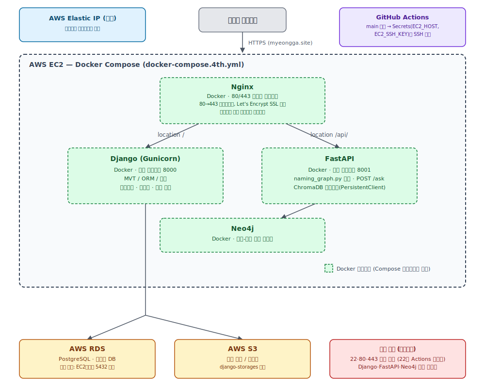

# 4차 프로젝트 계획 — 작명 QA 웹 서비스화

> 3차 프로젝트(작명 QA 시스템)를 Django 기반 웹 서비스로 발전시키고 AWS EC2에 배포한다.
> 평가 기준: 요구사항 정의서 / 화면설계서 / LLM 연동 웹 애플리케이션 / 시스템 구성도 / 테스트 보고서 (각 20점)

---

## 1. 전체 아키텍처

> **전부 Docker화** — Nginx/Gunicorn/Django/FastAPI/Neo4j 전체를 Docker Compose로 통합. `git push` → `main` 병합 → EC2에서 `git pull` + `docker compose up --build -d` 한 줄로 자동 배포가 가능하도록 하기 위한 결정. (커리큘럼 Day76의 venv+systemd 방식과는 다르지만, 배포 자동화 편의성을 우선한 팀 결정)



---

## 2. 서비스별 역할

| 서비스 | 역할 | 실행 방식 |
|--------|------|----------|
| **Nginx** | 리버스 프록시, HTTPS 처리, 정적 파일 서빙 | Docker 컨테이너, 80/443을 호스트에 퍼블리시 |
| **Gunicorn** | WSGI 서버, Django 애플리케이션 실행 | Django 컨테이너 내부 프로세스 |
| **Django** | MVT/ORM/FBV·CBV, 폼 검증, 인증·권한 처리 | Docker 컨테이너, 내부 네트워크(8000)만 사용 |
| **FastAPI** | LangGraph 파이프라인 호출, `/ask` 엔드포인트 | Docker 컨테이너, 내부 네트워크(8001)만 사용 |
| **PostgreSQL** | 사용자 계정, 작명 이력 | AWS RDS (관리형, 컨테이너화하지 않음) |
| **S3** | 정적 파일(CSS/JS), 미디어 파일 | django-storages 연동 |
| **Neo4j** | 한자-오행 관계 그래프 조회 | Docker 컨테이너 |
| **ChromaDB** | 한자/수리/오행/법령/순우리말 벡터 검색 | FastAPI 컨테이너 내 임베디드(PersistentClient) + 볼륨 마운트 |

Nginx만 호스트에 포트를 퍼블리시하고, Django/FastAPI/Neo4j는 Docker Compose 내부 네트워크에서 서비스명(`django`, `fastapi`, `neo4j`)으로만 서로 통신한다. RDS는 관리형 서비스이므로 컨테이너화 대상이 아니다.

---

## 3. 필수 산출물 및 체크리스트

### 3-1. 요구사항 정의서

- [ ] 기능 요구사항 — 인증·권한, LLM 연동, 작명 이력 CRUD
- [ ] 비기능 요구사항 — 반응형 UI, 배포 환경, 응답 시간
- [ ] LLM 연동 요구사항 — FastAPI `/ask` 입출력 형식, 비동기 호출 방식, 타임아웃·예외 처리
- [ ] 사용자 시나리오 — 비회원/회원/관리자 유스케이스
- [ ] 요구사항 ID 부여 → 화면설계·개발·테스트와 추적 가능하게 연결

### 3-2. 화면설계서

- [ ] 반응형 UI — Flex/Grid 기반 레이아웃, 모바일/태블릿/데스크탑
- [ ] Django MVT 구조와 화면 매핑 (URL → View → Template)
- [ ] 인증 흐름 — 로그인/로그아웃/권한별 접근 제어 화면 분기
- [ ] LLM UX — 조건 입력 폼 → 로딩 스피너 → 결과 카드 상태 전환
- [ ] 오행 관계 시각화 화면 설계 (D3.js or vis.js)

### 3-3. 개발된 웹 애플리케이션

**프론트엔드**
- [ ] HTML5/CSS3 반응형 마크업 (Flex/Grid)
- [ ] ES6+ 문법, Fetch API + Async/Await 비동기 LLM 호출
- [ ] 로딩 상태 UI, 에러 메시지 처리

**Django 백엔드**
- [ ] MVT 구조 — Model / View(FBV·CBV 혼용) / Template
- [ ] ORM — 사용자, 작명 이력 모델
- [ ] 폼 검증 — 조건 입력 유효성 검사
- [ ] 인증·권한 — Django Auth + 로그인 데코레이터

**배포**
- [ ] AWS EC2 + Docker Compose 전체 배포 (Nginx/Django/FastAPI/Neo4j)
- [ ] AWS RDS PostgreSQL 연결
- [ ] AWS S3 정적 파일 연동 (django-storages)
- [ ] Nginx + Gunicorn 연계 구성 (Docker 내부 네트워크)
- [ ] GitHub Actions로 `main` 병합 시 자동 배포

### 3-4. 시스템 구성도

- [ ] 클라이언트 → Nginx(컨테이너) → Django(컨테이너, Gunicorn) / FastAPI(컨테이너) 데이터 흐름
- [ ] Django → RDS / S3 연결
- [ ] FastAPI → Neo4j / ChromaDB 연결
- [ ] AWS 보안 그룹 설정 (인바운드 22/80/443만 오픈, 나머지는 Docker 내부 네트워크)
- [ ] Docker 컨테이너 네트워크 관계 표현 (전체 서비스가 하나의 Compose 네트워크)

### 3-5. 테스트 계획 및 결과 보고서

- [ ] 기능 테스트 — 인증, 폼 검증, 작명 이력 CRUD
- [ ] LLM API 연동 테스트 — 호출 성공/실패, 타임아웃 예외 케이스
- [ ] 배포 환경 검증 — Docker 컨테이너 재현성, 서버 재기동 후 정상 동작
- [ ] 발견된 이슈 및 수정 이력 추적

---

## 4. Django 주요 기능

```
작명 조건 입력 폼
  → 성씨 / 성별 / 오행 선호 / 희망 뜻 / 이름 유형(한자·순우리말)

결과 페이지
  → 추천 이름 카드 (이름 + 한자 + 수리 판단 + 뜻)
  → 오행 상생/상극 관계 시각화 (D3.js / vis.js)
  → 작명 이력 저장 버튼

사용자 인증
  → 회원가입 / 로그인 / 작명 이력 조회 페이지

Django Admin
  → 사용자 관리, 데이터 모니터링
```

---

## 5. FastAPI 엔드포인트

```
POST /ask
  body:    { "query": "김씨 성에 吉수이고 木오행인 이름 추천해줘",
             "history": [...] }
  response: { "answer": "...", "context": [...] }

GET  /health
  response: { "status": "ok" }
```

Nginx가 `/api/` 경로를 `http://fastapi:8001`로 프록시 (Docker Compose 내부 네트워크, 서비스명으로 통신).
FastAPI 컨테이너는 호스트에 포트를 퍼블리시하지 않음 — 같은 네트워크의 Nginx만 호출 가능, 외부 인터넷에서는 접근 불가.

---

## 6. Docker Compose 구성 (전체)

**기존 `docker-compose.yml`(3차 프로젝트 파일)은 건드리지 않고, 4차 전용 `docker-compose.4th.yml`을 루트에 신규 작성한다.**

```yaml
# docker-compose.4th.yml
services:
  nginx:
    build: ./deploy/nginx
    ports:
      - "80:80"
      - "443:443"
    depends_on:
      - django
      - fastapi
    volumes:
      - static_volume:/static
      - ./deploy/certbot/conf:/etc/letsencrypt   # HTTPS 적용 시

  django:
    build:
      context: ./webapp
    env_file: .env
    depends_on: []          # RDS는 외부 관리형 서비스라 depends_on 대상 아님
    volumes:
      - static_volume:/app/static
    expose:
      - "8000"              # 내부 네트워크 전용, 호스트에 퍼블리시하지 않음

  fastapi:
    build:
      context: .
      dockerfile: deploy/Dockerfile.fastapi
    env_file: .env
    volumes:
      - ./data:/app/data    # ChromaDB PersistentClient 영속화 (읽기 전용 참고)
    expose:
      - "8001"

  neo4j:
    image: neo4j:5
    environment:
      - NEO4J_AUTH=${NEO4J_USER}/${NEO4J_PASSWORD}
    volumes:
      - neo4j_data:/data
    expose:
      - "7474"
      - "7687"

volumes:
  static_volume:
  neo4j_data:
```

**신규 디렉토리 (3차 프로젝트 폴더와 분리, 전부 루트 하위 신규 경로):**

```
webapp/                 # Django 프로젝트 (신규)
deploy/
  nginx/
    Dockerfile
    nginx.conf          # location / → django:8000, location /api/ → fastapi:8001
  Dockerfile.fastapi    # FastAPI 앱 — naming_graph.py를 읽기 전용으로 import
docker-compose.4th.yml  # 신규 (기존 docker-compose.yml 미변경)
```

### 6-1. Nginx 설정 (`deploy/nginx/nginx.conf`)

```nginx
server {
    listen 80;

    location /static/ {
        alias /static/;
    }

    location /api/ {
        proxy_pass http://fastapi:8001/;
        proxy_set_header Host $host;
        proxy_set_header X-Real-IP $remote_addr;
    }

    location / {
        proxy_pass http://django:8000;
        proxy_set_header Host $host;
        proxy_set_header X-Real-IP $remote_addr;
    }
}
```

### 6-2. RDS 연결 설정

- Django `settings.py`의 `DATABASES`에 RDS 엔드포인트/포트(5432)/자격증명을 `.env`로 관리 (컨테이너 환경변수로 주입)
- **RDS 보안 그룹 인바운드 규칙**: 포트 5432, 소스는 **EC2 보안 그룹**으로 제한 (0.0.0.0/0 금지)
- RDS·S3는 관리형 서비스이므로 컨테이너화하지 않는다 — 평가 기준이 명시한 "AWS(EC2·RDS·S3)"를 각각 실제 서비스로 충족

---

## 7. 배포 워크플로우 — GitHub Actions 자동 배포

```
팀원 작업 → feature 브랜치 push → PR → main 병합
                                          │
                                          ▼
                              GitHub Actions 트리거
                                          │
                                          ▼
                        EC2에 SSH 접속 (secrets로 키 관리)
                                          │
                                          ▼
                              git pull origin main
                                          │
                                          ▼
                docker compose -f docker-compose.4th.yml up --build -d
```

**`.github/workflows/deploy-4th.yml` 예시:**

```yaml
name: Deploy 4th Project to EC2

on:
  push:
    branches: [main]
    paths:
      - 'webapp/**'
      - 'deploy/**'
      - 'docker-compose.4th.yml'

jobs:
  deploy:
    runs-on: ubuntu-latest
    steps:
      - name: Deploy via SSH
        uses: appleboy/ssh-action@v1
        with:
          host: ${{ secrets.EC2_HOST }}
          username: ubuntu
          key: ${{ secrets.EC2_SSH_KEY }}
          script: |
            cd ~/SKN29-3RD-4Team
            git pull origin main
            docker compose -f docker-compose.4th.yml up --build -d
```

`paths` 필터로 3차 프로젝트 파일(`src/`, `data/`, `docs/` 등) 변경 시에는 배포가 트리거되지 않도록 제한 — 3차 산출물과 4차 배포 파이프라인을 분리.

필요한 GitHub Secrets: `EC2_HOST`(퍼블릭 IP), `EC2_SSH_KEY`(pem 키 내용).

---

## 8. 팀 역할 분담 (4명 기준)

| 역할 | 담당 내용 |
|------|----------|
| Django 웹 개발 | MVT 구조, 인증, 폼 검증, 작명 이력 CRUD |
| 프론트엔드 | 반응형 UI(Flex/Grid), Fetch API 비동기 연동, 오행 시각화 |
| FastAPI + LangGraph | naming_graph.py 래핑, `/ask` API 서버 |
| AWS 인프라 | EC2·RDS·S3 세팅, Docker Compose 전체 구성, GitHub Actions 배포 파이프라인 |

---

## 9. 개발 순서

1. **요구사항 정의서** 작성 (요구사항 ID 포함)
2. **화면설계서** 작성 (Figma or 손그림, Django URL 매핑 포함)
3. FastAPI `/ask` 엔드포인트 구현 및 로컬 테스트
4. Django 프로젝트 초기 세팅 (모델, 인증, 폼, Admin)
5. Django ↔ FastAPI 비동기 연동 확인
6. 프론트엔드 반응형 UI + 오행 시각화 구현
7. `docker-compose.4th.yml` 및 Dockerfile 작성, 로컬에서 전체 스택 통합 테스트
8. AWS EC2 세팅 후 배포 (RDS·S3 연결)
9. GitHub Actions 워크플로우 작성 및 자동 배포 확인
10. 테스트 케이스 작성 및 결과 보고서 작성
11. 도메인 연결 + HTTPS (Let's Encrypt, Certbot 컨테이너)

---

## 10. 3차 평가 피드백 반영

| 3차 피드백 | 4차 구현 |
|-----------|---------|
| 질문~결과 흐름을 직관적으로 | 조건 입력 폼 → 로딩 스피너 → 결과 카드 UX |
| 추천 근거/관계 정보를 시각적으로 | Neo4j 오행 상생/상극 관계 그래프 시각화 |
| Graph 구조를 웹과 유기적으로 연결 | 추천 한자 클릭 시 Neo4j 관계 동적 탐색 |

---

## 11. EC2 인스턴스 설정

**사용 기간: 약 1주일 (프로젝트 기간 한정)**

### 인스턴스 유형

일주일 기준 인스턴스 간 비용 차이는 무의미(t3.micro~c7i-flex.large 최대 $14 차이) 하므로 **메모리 여유를 우선** — Nginx+Django+FastAPI+Neo4j+ChromaDB를 한 서버에 동시 구동 시 1~2GB는 OOM 위험이 큼.

| 인스턴스 | RAM | 시간당 요금 | 일주일(168h) 비용 |
|---------|-----|-----------|-----------------|
| t3.micro | 1GB | $0.013 | 약 $2.2 |
| t3.small | 2GB | $0.026 | 약 $4.4 |
| **c7i-flex.large (권장)** | **4GB** | $0.09576 | 약 $16.1 |

> AWS 프리 티어 정책은 계정 생성 시점(2025.7.15 기준)에 따라 다름 — 이후 생성 계정은 "750시간 무료"가 아닌 **$200 크레딧(6개월)** 방식. 크레딧 소진 여부만 확인하면 되므로 인스턴스 유형은 자유롭게 선택 가능.

### 보안 그룹

인바운드 규칙은 3개만 오픈:

| 유형 | 포트 | 소스 | 용도 |
|------|------|------|------|
| SSH | 22 | 0.0.0.0/0 | 서버 접속 + GitHub Actions 자동 배포 (러너 IP 유동적이라 전체 개방) |
| HTTP | 80 | 0.0.0.0/0 | 웹 서비스 (Nginx 컨테이너) |
| HTTPS | 443 | 0.0.0.0/0 | HTTPS (Nginx 컨테이너) |

Django(8000), FastAPI(8001), Neo4j(7474/7687)는 전부 Docker Compose 내부 네트워크 전용 — 보안 그룹에 규칙 추가 불필요.

### 사용 후 처리 (필수)

프로젝트 종료 시 **Stop이 아닌 Terminate(종료)** 로 처리:

| 상태 | 과금 여부 |
|------|----------|
| Stop (중지) | 컴퓨팅 요금은 안 나가지만 EBS 볼륨 요금은 계속 발생 |
| **Terminate (종료)** | 완전 삭제, 과금 중단 |
