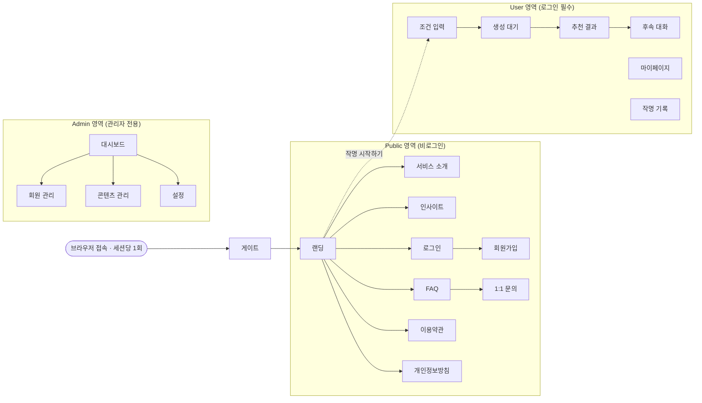
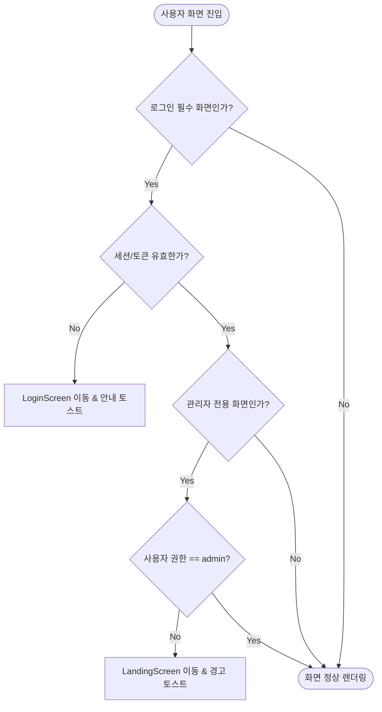
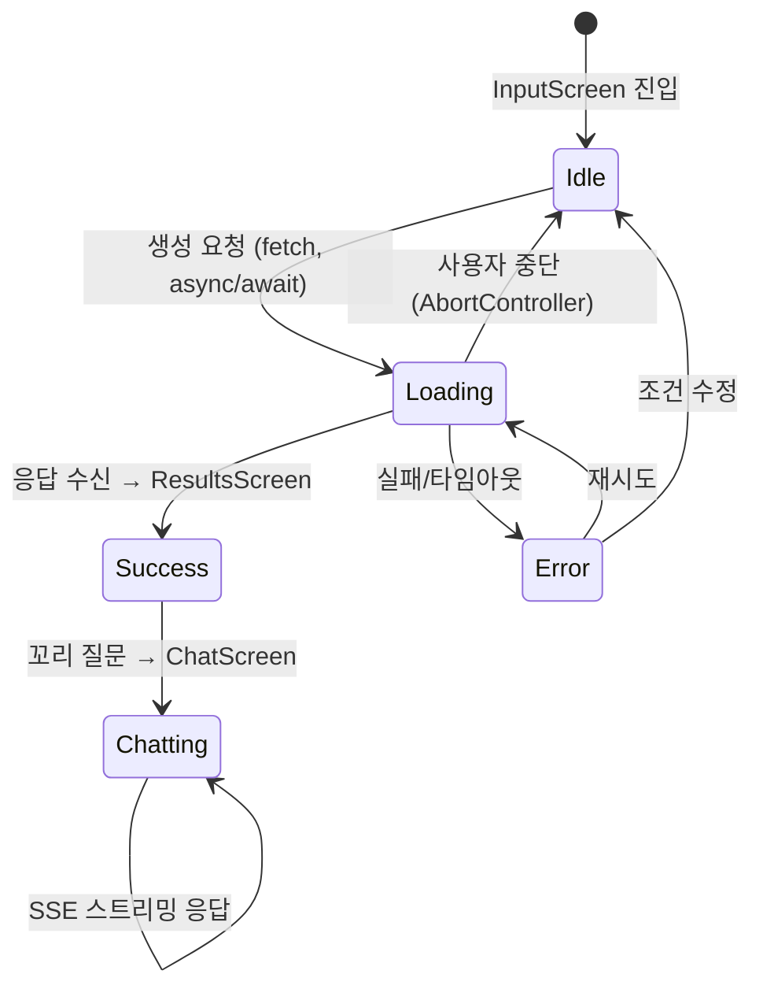

# 명가작명소 화면설계서 (Screen Design Document)

| 항목 | 내용 |
| :--- | :--- |
| 문서명 | 명가작명소 화면설계서 |
| 버전 | v1.0 (Final) |
| 프로젝트 | LLM 연동 AI 작명 서비스 웹 애플리케이션 |
| 대상 화면 | 프론트엔드 데모 전체 19개 화면 |
| 연계 산출물 | 요구사항 정의서 · 시스템 구성도 · 테스트 계획서 |

본 문서는 프론트엔드 데모의 전체 19개 화면을 대상으로 화면 구조, 반응형 레이아웃, 인증·권한 흐름, LLM 상호작용 UX, 그리고 백엔드(Django MVT) 구조와의 연계 방식을 정의한다. 요구사항 정의서의 각 기능 요구사항은 4장 매핑 테이블을 통해 화면 단위로 추적할 수 있다.

---

## 1. 화면 구성 총괄 (Information Architecture)

서비스는 접근 권한에 따라 3개 영역, 총 19개 화면으로 구성된다.



게이트는 로그인 여부·목적 화면과 무관하게 브라우저 세션당 1회, 최초 화면이 렌더링되기 전에 노출되는 오프닝 연출이다(3장 참고). 이후 핵심 사용자 여정은 `랜딩 → (작명 시작하기) → 조건 입력 → 생성 대기 → 추천 결과 → 후속 대화`이며, 비로그인 상태로 진입 시 로그인 화면을 거쳐 원래 목적지로 복귀한다. LLM 질의-응답이 이 여정의 중심에 위치한다. `NotFoundScreen`은 전 영역 공통의 404 폴백으로 동작한다.

---

## 2. 반응형 UI 설계 (Responsive UI Design)

### 2.1 레이아웃 전략

TailwindCSS 유틸리티 기반의 **모바일 우선(Mobile-First)** 설계를 적용한다. 기본 클래스는 모바일(360px~) 기준으로 작성하고, 중단점 접두사로 상위 해상도 레이아웃을 점진적으로 확장한다.

| 중단점 | 기준 폭 | 대상 기기 | 주요 레이아웃 변화 |
| :--- | :--- | :--- | :--- |
| (기본) | ~639px | 모바일 | 단일 컬럼, 햄버거 메뉴, 카드 세로 스택 |
| `sm` | 640px~ | 대형 모바일 | 폼 요소 2열 배치 시작 |
| `md` | 768px~ | 태블릿 | GNB 가로 노출, 결과 카드 2열 Grid |
| `lg` | 1024px~ | 데스크톱 | 12컬럼 Grid 본격 적용, 사이드 패널 노출 |
| `xl` | 1280px~ | 와이드 | 콘텐츠 최대 폭 고정(`max-w-7xl`) + 중앙 정렬 |

### 2.2 Flex / Grid 적용 원칙

- **Flexbox — 1차원 배치**: GNB, 버튼 그룹, 폼 라벨-입력 쌍, 채팅 말풍선 정렬에 `flex`, `flex-col`, `items-center`, `justify-between`을 사용한다. 화면 폭이 줄면 `flex-col`로 전환해 세로 스택으로 재배치한다.
- **CSS Grid — 2차원 배치**: 조건 입력 화면의 데스크톱 뷰(`lg:grid lg:grid-cols-12`), 추천 결과 카드 리스트(`grid-cols-1 md:grid-cols-2 lg:grid-cols-3`), 관리자 대시보드 지표 카드(`grid-cols-2 lg:grid-cols-4`) 등 다차원 배치 구간에 12컬럼 Grid를 적용한다.
- **마크업 표준**: 전 화면 HTML5 시맨틱 태그(`header`, `nav`, `main`, `section`, `footer`)를 사용하고, 상호작용 요소는 `aria-*` 속성과 키보드 포커스를 보장한다.

### 2.3 주요 화면 반응형 규칙

| 화면 | 모바일 (~md) | 데스크톱 (lg~) |
| :--- | :--- | :--- |
| InputScreen | 탭·입력·요약을 세로 스택 | 12컬럼 Grid — 좌 8컬럼 입력, 우 4컬럼 조건 요약 고정 패널 |
| ResultsScreen | 카드 1열, 하단 고정 질문 입력바 | 카드 3열 Grid, 상세는 모달로 오버레이 |
| ChatScreen | 전체 폭 말풍선 + 하단 입력 | 중앙 720px 대화 영역, 좌측 결과 요약 사이드바 |
| AdminDashboard | 지표 카드 2열 | 지표 4열 + 차트 2열 Grid |

---

## 3. 주요 화면 상세 설계 (Key Screen Wireframes)

LLM 질의-응답 여정의 4개 핵심 화면에 대한 레이아웃 정의이다.

### 3.1 InputScreen — 작명 조건 입력

```
[모바일]                          [데스크톱 lg: 12-col Grid]
┌──────────────────┐   ┌─────────────────────────────────────┐
│ GNB (햄버거)      │   │ GNB (가로 메뉴)                       │
├──────────────────┤   ├────────────────────────┬────────────┤
│ [자연어] [상세조건] │   │ [자연어] [상세조건] 탭    │  조건 요약   │
├──────────────────┤   │ ┌────────────────────┐ │  패널       │
│ 자연어 입력 영역    │   │ │ 자연어 텍스트 입력    │ │  (인식 조건  │
│ (textarea)       │   │ │                    │ │   칩 목록)   │
├──────────────────┤   │ └────────────────────┘ │            │
│ 인식된 조건 칩 ▾   │   │  성씨 · 성별 · 출생정보   │ (col 9-12) │
├──────────────────┤   │  (col 1-8)             │            │
│ [이름 생성하기]    │   ├────────────────────────┴────────────┤
└──────────────────┘   │            [이름 생성하기]             │
                       └─────────────────────────────────────┘
```

- **자연어 / 상세조건 이중 입력**: 탭 전환으로 자유 서술(`mode="natural"`)과 구조적 조건(`mode="structured"`)을 모두 지원한다.
- **실시간 파싱 피드백**: 자연어 입력 중 `input` 이벤트를 디바운스(300ms) 처리하여 인식된 조건 칩(성별, 항렬, 분위기 등)을 즉시 점등한다. 사용자는 LLM 요청 전에 자신의 의도가 올바르게 해석되는지 확인할 수 있다.
- **제출 가드**: 필수 조건(성씨, 성별) 미충족 시 생성 버튼을 `disabled` 처리하고 미충족 항목을 인라인으로 표시한다.

### 3.2 ProcessingScreen — LLM 생성 대기

```
┌──────────────────────────┐
│                          │
│      (로고 바운스 애니메이션)  │
│                          │
│   ● 조건 분석  ─ 완료       │
│   ● 오행 대조  ─ 진행 중 ◌   │
│   ○ 법령 검증               │
│   ○ 이름 엄선               │
│                          │
│   [██████████░░░░] 62%    │
│                          │
│  [생성 중단]  [조건 수정하기]  │
└──────────────────────────┘
```

- **4단계 진행 시각화**: 단순 스피너 대신 실제 처리 단계(조건 분석 → 오행 대조 → 법령 검증 → 이름 엄선)를 텍스트와 진행률 바로 노출하여 대기 시간의 체감 길이를 줄인다.
- **사용자 통제권**: 생성 중 언제든 `AbortController`로 요청을 중단(생성 중단)하거나 입력 화면으로 복귀(조건 수정하기)할 수 있다.

### 3.3 ResultsScreen — 추천 결과

```
[데스크톱: 3열 카드 Grid]
┌─────────────────────────────────────┐
│ GNB                                  │
├───────────┬───────────┬─────────────┤
│ 이름 카드 1 │ 이름 카드 2 │ 이름 카드 3   │
│ 한자·오행    │ (Skeleton │ (Skeleton    │
│ 점수·풀이    │  → 순차 공개)│  → 순차 공개) │
├───────────┴───────────┴─────────────┤
│ 💬 추가로 궁금한 점을 물어보세요  [전송]  │
└─────────────────────────────────────┘
```

- **순차 공개 렌더링**: 응답 도착 전 `SkeletonCard`를 먼저 노출하고, 일정 간격(`CARD_REVEAL_INTERVAL_MS`)으로 카드를 순차 공개하여 스트리밍 응답과 같은 경험을 만든다.
- **상세 모달**: 카드 클릭 시 획수·오행 분석, 발음 평가, 법령 검증 결과를 모달로 제공하고, 즐겨찾기(저장) 액션을 배치한다.
- **연속 상호작용**: 하단 고정 입력바에서 곧바로 꼬리 질문을 이어갈 수 있어 결과 확인과 후속 대화가 단절되지 않는다.

### 3.4 ChatScreen — 후속 대화

- 말풍선 리스트는 `flex-col` 스택으로 배치하고, 사용자/AI 메시지를 `justify-end` / `justify-start`로 구분한다.
- AI 응답은 SSE 스트리밍으로 토큰 단위 타이핑 효과를 렌더링하며, 응답 수신 중에는 입력창을 잠그고 "답변 생성 중..." 인디케이터를 노출한다.
- 대화 문맥은 세션 내 유지되어 직전 추천 결과를 참조한 질의("두 번째 이름 획수 다시 알려줘")가 가능하다.

---

## 4. 인증 흐름 및 권한별 접근 제어 설계 (Auth Flow Design)

모든 화면 진입 시 전역 라우터 가드가 권한을 판별하여 비인가 접근을 차단한다.



### 4.1 접근 권한 그룹

| 그룹 | 화면 | 차단 시 동작 |
| :--- | :--- | :--- |
| 공통 (Pre-route) | 게이트 | 접근 제한 없음 — 로그인 여부와 무관하게 브라우저 세션당 1회, 다른 어떤 화면보다 먼저 노출 후 원래 목적지로 진행 |
| Public | 랜딩, 서비스 소개, 인사이트, 로그인/회원가입, FAQ, 1:1 문의, 약관/개인정보방침, 404 | 제한 없음 |
| User | 조건 입력, 생성 대기, 추천 결과, 후속 대화, 마이페이지, 작명 기록 | "로그인이 필요한 페이지입니다" 토스트 → `LoginScreen` 리다이렉트 |
| Admin | 관리자 대시보드, 회원 관리, 콘텐츠 관리, 설정 | "관리자 계정으로 로그인해 주세요" 경고 → `LandingScreen` 강제 이동 |

### 4.2 인증 흐름 시나리오

1. **최초 접속 시 게이트 연출**: 로그인 여부·접속 경로와 무관하게 브라우저 세션당 1회, 최초 화면이 렌더링되기 전에 게이트(대문) 오프닝 연출을 노출한다. `sessionStorage` 플래그로 노출 여부를 기억하며, 같은 세션 내 새로고침이나 재방문 시에는 다시 노출하지 않는다. 세션이 새로 시작되면(새 탭/브라우저 재실행) 다시 한 번 노출된다.
2. **비로그인 사용자의 User 영역 접근**: `RequireAuth` 라우트 가드가 해시 변경을 가로채 토스트 알림 후 즉시 `LoginScreen`으로 리다이렉트한다. 로그인 성공 시 원래 목적지 화면으로 복귀한다.
3. **일반 사용자의 Admin 영역 접근**: 권한 검증 실패 시 경고 토스트 후 `LandingScreen`으로 이동시키며, Admin 메뉴 자체가 일반 사용자 GNB에 렌더링되지 않도록 이중으로 차단한다.
4. **세션 만료 중 LLM 요청**: 생성/대화 요청이 401을 반환하면 진행 중 화면을 정리하고 재로그인을 유도한다. 입력했던 조건은 클라이언트 상태에 보존하여 재로그인 후 이어서 진행할 수 있다.

---

## 5. LLM 상호작용 UX 설계 (LLM Interaction UX)

LLM 특성상 필연적인 **비동기 대기 시간**과 **실패 가능성**을 화면 상태로 명시적으로 설계한다.

### 5.1 상태 전이 모델



### 5.2 상태별 화면 처리

| 상태 | 화면 | 처리 |
| :--- | :--- | :--- |
| 입력 (Idle) | InputScreen | 실시간 파싱 칩 피드백, 필수값 미충족 시 제출 차단 |
| 대기 (Loading) | ProcessingScreen | 4단계 진행 애니메이션 + 진행률 바, 중단/수정 액션 상시 노출 |
| 성공 (Success) | ResultsScreen | Skeleton → 카드 순차 공개, 상세 모달, 후속 질문 입력바 |
| 실패 (Error) | 공통 에러 뷰 | 원인별 안내 문구 + [다시 시도] / [조건 수정] 버튼 |
| 대화 (Chatting) | ChatScreen | 토큰 스트리밍 타이핑 효과, 수신 중 입력 잠금 |

### 5.3 비동기 통신 및 예외 처리 설계

- **호출 방식**: 모든 LLM 요청은 ES6+ `async/await` 기반 `fetch` 공통 모듈로 수행하고, `try...catch...finally`로 로딩 상태를 반드시 해제한다.
- **타임아웃**: 생성 요청은 60초 타임아웃(`AbortSignal.timeout`)을 설정하고, 초과 시 "응답이 지연되고 있어요" 안내와 함께 재시도 버튼을 제공한다.
- **예외 케이스별 UX**:

| 예외 | 사용자 안내 | 후속 액션 |
| :--- | :--- | :--- |
| 네트워크 단절 | "연결이 불안정합니다" | 재시도 |
| LLM API 오류(5xx) | "이름 생성에 실패했어요. 잠시 후 다시 시도해 주세요" | 재시도 (조건 보존) |
| 타임아웃 | "응답이 지연되고 있어요" | 재시도 / 조건 수정 |
| 세션 만료(401) | "다시 로그인해 주세요" | 로그인 이동 (조건 보존) |
| 부적절 입력 거부 | "입력 조건을 확인해 주세요" | 조건 수정 |

- **중복 요청 방지**: 요청 진행 중 생성 버튼을 비활성화하고, 화면 이탈 시 `AbortController`로 미완료 요청을 정리한다.

---

## 6. 화면-구조 매핑 정합성 (Screen-Structure Mapping)

전체 19개 화면과 백엔드 Django MVT(Model-View-Template) 구조, REST API 엔드포인트의 매핑 테이블이다. 요구사항 정의서의 기능 ID는 각 화면의 '주요 기능' 열로 추적된다.

| 화면명 (컴포넌트) | URL 해시 | 주요 기능 및 요구사항 매핑 | Auth | Django 뷰 타입 (FBV/CBV) | 연계 Django Form / ORM 모델 | 연계 API 엔드포인트 |
| :--- | :--- | :--- | :---: | :--- | :--- | :--- |
| **LandingScreen** | `#/landing` | 메인 히어로 소개, 브랜드 가치 제안, 작명 시작 유도 | X | `TemplateView` | N/A | `GET /api/home/` (메타데이터) |
| **GateScreen** | N/A (상태) | 세살문 3D 오프닝 인터랙티브 시퀀스 — 브라우저 세션당 1회, 로그인 여부와 무관하게 최초 화면 진입 전 노출 | X | 프론트엔드 단독 | N/A | N/A (Client-side Only, `sessionStorage`) |
| **LoginScreen** | `#/login` | 회원 로그인 폼 검증, 카카오 로그인 연동 | X | `View` (FBV) | `AuthenticationForm` | `POST /api/auth/login/` |
| **SignupScreen** | `#/signup` | 신규 회원 등록 및 비밀번호 유효성 검증 | X | `CreateView` (CBV) | `UserCreationForm` | `POST /api/auth/signup/` |
| **ServiceIntroScreen**| `#/intro` | 서비스 이론적 배경(수리, 오행, 법령) 설명 | X | `TemplateView` | N/A | N/A (정적 리소스) |
| **InputScreen** | `#/input` | 작명 조건 입력 (자연어 파싱 피드백 포함) | O | 프론트엔드 단독 | N/A | N/A (Client-side State) |
| **ProcessingScreen**| N/A (상태) | 비동기 작명 요청 전송 및 로딩 프로세스 노출 | O | `View` (비동기 처리) | Celery Task / Async View | `POST /api/names/generate/` |
| **ResultsScreen** | `#/results` | 엄선된 추천 이름 리스트 및 상세 모달 제공 | O | `DetailView` (CBV) | `NamingResult` / `SavedName` | (Processing 응답 연계) |
| **ChatScreen** | `#/chat` | 챗봇 형태의 추천 결과에 대한 추가 대화 질의 | O | `View` (스트리밍) | `ChatMessage` (ORM 모델) | `POST /api/chat/ask/` (SSE) |
| **MyPageScreen** | `#/mypage` | 비밀번호 변경, 닉네임 수정, 회원 탈퇴 | O | `UpdateView` (CBV) | `UserChangeForm` / `User` | `GET/PUT/DELETE /api/users/me/` |
| **HistoryScreen** | `#/history` | 이전 작명 요청 이력 및 즐겨찾기 이름 관리 | O | `ListView` (CBV) | `NamingHistory` / `SavedName` | `GET /api/names/history/` |
| **InsightsScreen** | `#/insights` | 출생 통계 차트 및 남아/여아 인기 트렌드 리스트 | X | `ListView` (CBV) | `BirthStats` / `InsightArticle` | `GET /api/insights/trends/`<br>`GET /api/insights/articles/` |
| **SupportScreen (FAQ)**| `#/faq` | 카테고리별 자주 묻는 질문 아코디언 및 검색 | X | `ListView` (CBV) | `FAQ` (ORM 모델) | `GET /api/support/faq/` |
| **SupportScreen (Inquiry)**| `#/contact` | 1:1 문의글 작성 및 유효성 검증 폼 | X | `CreateView` (CBV) | `ContactForm` / `Contact` | `POST /api/support/contact/` |
| **PolicyScreen (Terms)**| `#/terms` | 이용약관 정적 정보 노출 | X | `TemplateView` | `TermsOfService` (ORM 모델) | `GET /api/policies/terms/` |
| **PolicyScreen (Privacy)**| `#/privacy` | 개인정보처리방침 정적 정보 노출 | X | `TemplateView` | `PrivacyPolicy` (ORM 모델) | `GET /api/policies/privacy/` |
| **NotFoundScreen** | `#/notFound`| 존재하지 않는 페이지 404 예외 처리 핸들러 | X | `TemplateView` | N/A | N/A (Client-side Fallback) |
| **AdminDashboard** | `#/adminDashboard`| 일일 신규 가입자, 작명 건수, 트래픽 통계 지표 | Admin | `TemplateView` | N/A (Dashboard Aggregate Query)| `GET /api/admin/stats/` |
| **AdminContent** | `#/adminContent` | 공지사항, FAQ, 아티클 콘텐츠 추가/수정/삭제 | Admin | `UpdateView` (CBV) | `FAQForm` / `ArticleForm` | `GET/PUT/DELETE /api/admin/contents/` |
| **AdminUsers** | `#/adminUsers` | 전체 회원 정보 조회 및 이용 제한(블랙리스트) 관리 | Admin | `ListView` (CBV) | `User` (ORM 모델) | `GET/PUT /api/admin/users/` |
| **AdminSettings** | `#/adminSettings`| 추천 개수 설정, 점검 모드(서비스 중단) 토글 | Admin | `UpdateView` (CBV) | `SiteSettings` (Singleton 모델) | `GET/PUT /api/admin/settings/` |

---

## 7. 프론트엔드-백엔드 연계 설계

### 7.1 Django CSRF 대응

- Django 비동기 POST API 호출 시 요청 헤더에 `X-CSRFToken`을 필수 적재한다.
- 프론트엔드 공통 통신 모듈(Fetch)이 쿠키의 `csrftoken` 값을 파싱하여 모든 변경성 요청(POST/PUT/DELETE)의 공통 헤더로 자동 첨부한다.

### 7.2 2단계 폼 유효성 검증

| 단계 | 위치 | 검증 내용 | 목적 |
| :--- | :--- | :--- | :--- |
| 1차 | 프론트엔드 | 이메일 정규식(`isValidEmail`), 비밀번호 8자 이상, 약관 동의, 필수값 | 즉각 피드백, 불필요한 서버 트래픽 차단 |
| 2차 | Django Form | `clean_email()` 중복 가입 방지, `clean_password()` 정책 검증, ORM 파라미터 바인딩 | 데이터 무결성 및 보안 최종 보증 |

- 2차 검증 실패 시 백엔드는 필드별 오류를 JSON(`{field: [messages]}`)으로 반환하고, 프론트엔드는 이를 해당 입력 필드 하단 인라인 메시지로 매핑해 표시한다.

### 7.3 공통 오류 응답 처리

- 모든 API 오류 응답은 `{code, message}` 규격을 따르며, 프론트엔드 공통 인터셉터가 상태 코드별(401 → 로그인 유도, 403 → 권한 안내, 5xx → 재시도 안내) 표준 토스트/뷰로 분기한다.
